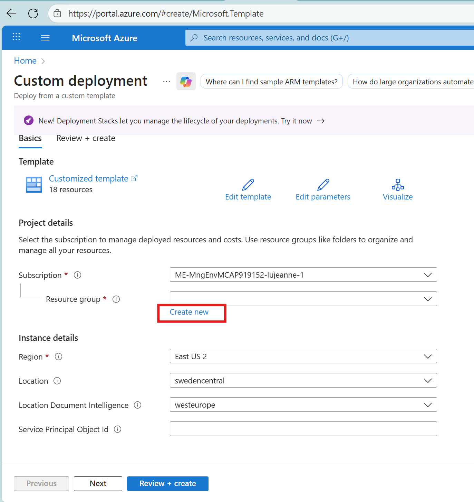
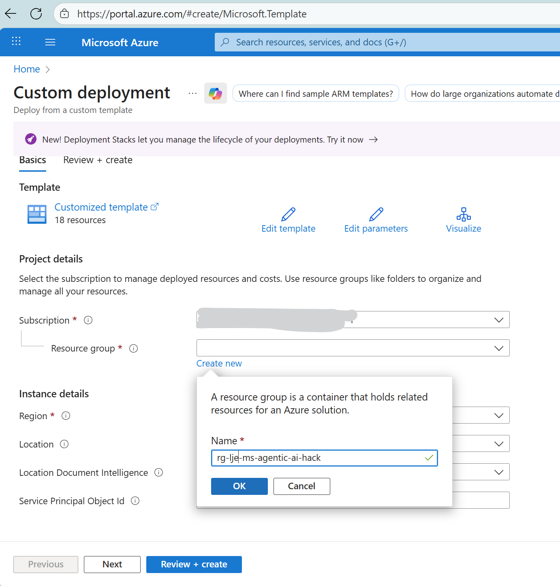
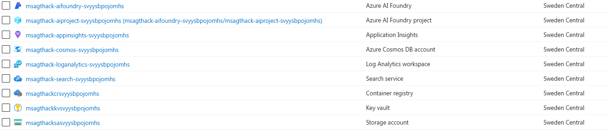

# 1. Environment Creation and Resources Deployment

**Expected Duration:** 30 minutes

Welcome to your very first challenge! Your goal in this challenge is to create the services and enviornment necessary to conduct this hackathon. You will deploy the required resources in Azure, create your development enviornment and all the assets necessary for the subsequent challenges. By completing this challenge, you will set up the foundation for the rest of the hackathon. 

If something is not working correctly, please do let your coach know!

## Before you start
Make sure you follow the instructions in the main [README](../README.md#local-environment-setup) to set up your local development environment and install the necessary dependencies.

## 1.1 Resource Deployment Guide
The first step on this hackathon will be to create the resources we will use throughout the day. You can deploy using either the one-click button or manual method below.

Before anything else, let's log in into the CLI with our account. Please paste the code underneath and follow the necessary instructions.

```bash
az login --use-device-code
```

## 1.1.1 Resources Deployment

Now, time to deploy our resources to Azure!

[](https://portal.azure.com/#create/Microsoft.Template/uri/https%3A%2F%2Fraw.githubusercontent.com%2Fmartaldsantos%2Fagentic-ai-hack%2Fmain%2Fchallenge-0%2Fiac%2Fazuredeploy.json)

You should see a screen similar to this one:


**Deployment Parameters:**
- subscription: Select the subscription where you want to deploy the resources. It should be the default one you are using for this hackathon.
- resource group: Introduce the unique name for your resource group (example: rg-yourinitials-ms-agentic-ai-hack).


Once you have filled in the parameters, click on "Review + Create" and then "Create" to start the deployment.

**NOTE:** Some parts of your deployment may fail if the resource provider `Microsoft.AlertsManagement` is not registered in your. Follow the [documentation](https://learn.microsoft.com/en-us/azure/azure-resource-manager/management/resource-providers-and-types#register-resource-provider-1) to register it and the re-run the deployment.

Resource deployment can take up to 10 minutes, afterwards you'll be able to find most of the resources on your resource group. 


## 1.2 Verify the creation of your resources

Go back to your `Azure Portal` and find your `Resource Group`that should by now contain 9 resources and look like this:



## 1.3 Let's retrieve the necessary keys
After deploying the resources, you will need to configure the environment variables in the `.env` file. Double check you have logged in into your Azure account on the CLI. If that's settled, let's move into retrieving our keys. The `.env` file is a configuration file that contains the environment variables for the application. The `.env` file is automatically created by running the following command within the terminal in your Codespace.

**Then run the get-keys script with your resource group name:**
```bash
cd challenge-0 && ./get-keys.sh --resource-group YOUR_RESOURCE_GROUP_NAME
```

Replace `YOUR_RESOURCE_GROUP_NAME` with the actual name of the resource group created on step 1.3.

This script will connect to Azure and fetch the necessary keys and populate the `.env` file with the required values in the root directory of the repository.

## 1.4 Verify `.env` setup

When the script is finished, review the `.env` file to ensure that all the values are correct. If you need to make any changes, you can do so manually.

The repo has an `.env.sample` file that shows the relevant environment variables that need to be configured in this project. The script should create a `.env` file that has these same variables _but populated with the right values_ for your Azure resources.

If the file is not created, simply copy over `.env.sample` to `.env` - then populate those values manually from the respective Azure resource pages using the Azure Portal.

## Conclusion
By reaching this section you should have every resource and installed the requirements necessary to conduct the hackathon. In the next challenges, you will use these services to start strongly your Azure AI Agents journey.

Now the real fun begins!
